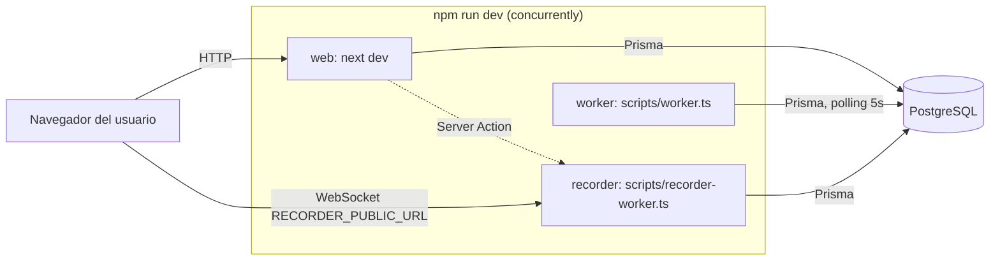
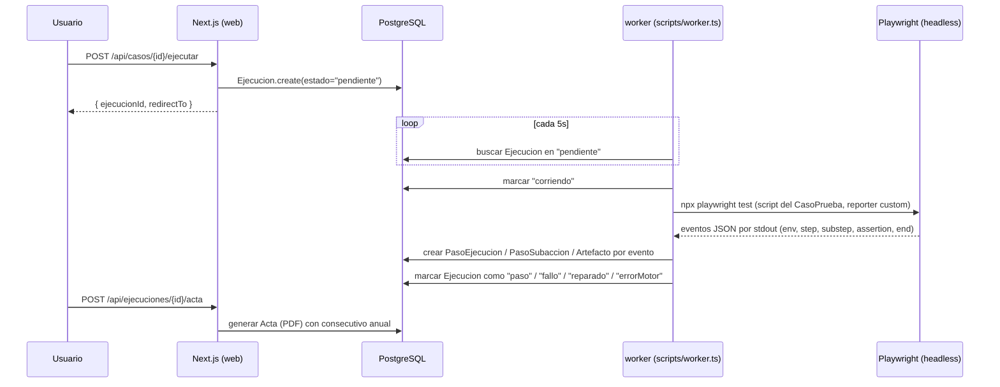
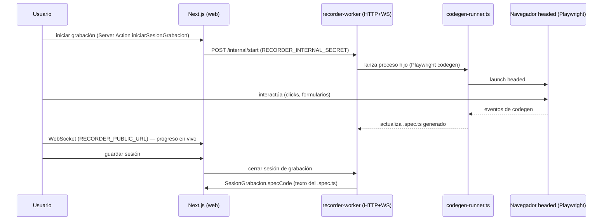
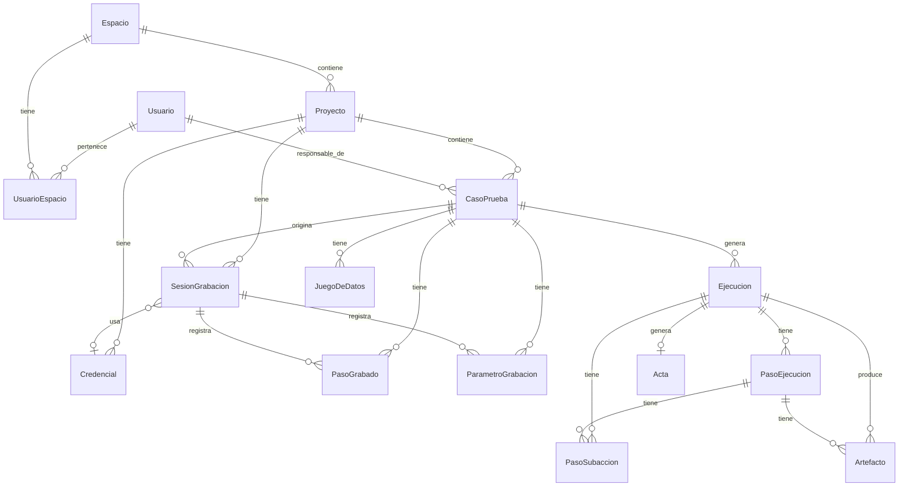

# Arquitectura

## Tabla de contenidos

- [Vista general](#vista-general)
- ["vorTest" vs "Acta"](#vortest-vs-acta)
- [Los tres procesos](#los-tres-procesos)
- [Flujo: ejecución de un caso de prueba](#flujo-ejecución-de-un-caso-de-prueba)
- [Flujo: modo grabador](#flujo-modo-grabador)
- [Modelo de datos](#modelo-de-datos)
- [Decisiones de diseño](#decisiones-de-diseño)

## Vista general

vorTest es un monolito Next.js (App Router) con dos procesos Node adicionales de larga duración que comparten la misma base de código y base de datos PostgreSQL vía Prisma:

- **web** — la app Next.js (páginas + `app/api/*` route handlers + Server Actions en `lib/*/actions.ts`).
- **worker** (`scripts/worker.ts`) — motor de ejecución: hace polling de `Ejecucion` en estado `pendiente` y corre el script de Playwright asociado.
- **recorder** (`scripts/recorder-worker.ts`) — servidor HTTP + WebSocket standalone para el modo grabador.

No hay cola de mensajes (Redis, etc.): la coordinación entre `web` y `worker` es vía polling sobre la tabla `Ejecucion`.

## "vorTest" vs "Acta"

Son dos cosas distintas y el nombre puede confundir:

- **vorTest** es el nombre del producto/plataforma.
- **Acta** es un concepto de dominio dentro del producto: el modelo Prisma `Acta` representa el PDF de evidencia que se genera al terminar una ejecución (`lib/acta/render-pdf.ts`, `lib/acta/template.ts`). Cada `Ejecucion` tiene como máximo un `Acta` asociado (relación 1-a-1, campo `Ejecucion.acta`).

## Los tres procesos

## Flujo: ejecución de un caso de prueba

Detalle del motor (`lib/worker/*`, `scripts/worker.ts`, `scripts/my-reporter.js`):
- El script de `CasoPrueba.script` se escribe a un archivo temporal y se corre con `npx playwright test`, usando la config de `playwright.config.ts` (`testDir: './runtime/ejecuciones'`).
- El reporter custom (`scripts/my-reporter.js`) emite eventos JSON por stdout que el worker parsea línea a línea para ir creando `PasoEjecucion`/`PasoSubaccion` en tiempo real (streaming de progreso).
- Los artefactos (`video`, `captura`, `trace`) se guardan como filas `Artefacto` con `sha256` y tamaño en bytes.
- Si un paso falla y se recupera con un selector de respaldo, el motor lo marca como auto-reparado (`PasoEjecucion.selfHealed`, estado `reparado`).

## Flujo: modo grabador

El script generado (`SesionGrabacion.specCode`) es la fuente de verdad; los `PasoGrabado` (una fila por paso detectado) se derivan del parseo del spec de forma best-effort y no se usan para regenerar el script (comentario en `prisma/schema.prisma`, modelo `SesionGrabacion`).

## Modelo de datos

16 modelos en `prisma/schema.prisma` (PostgreSQL, UUID v4 como PK, `camelCase`):

Enums: `EjecucionEstado` (`pendiente, corriendo, paso, fallo, reparado, errorMotor, cancelado`), `PasoEjecucionEstado` (`paso, fallo, reparado`), `ArtefactoTipo` (`video, captura, trace`), `CasoOrigen` (`subirScript, grabador, mixto`).

Reglas de integridad relevantes (comentario del schema): `Restrict` en relaciones hacia filas de evidencia (ej. no se puede borrar un `Proyecto` con `CasoPrueba` asociados), `Cascade` en filas hijas dependientes (ej. borrar una `Ejecucion` borra sus `PasoEjecucion`).

## Decisiones de diseño

- **Sin cola de mensajes**: la comunicación `web` → `worker` es indirecta, vía estado en base de datos (`Ejecucion.estado = "pendiente"`) y polling cada 5 segundos, no un broker dedicado.
- **Script como texto en BD, no archivo en disco**: `CasoPrueba.script` es una columna `TEXT`. El worker lo materializa a un archivo temporal solo al momento de ejecutar.
- **Modo grabador basado en `playwright codegen`, no en canvas + CDP screencast**: el enfoque vigente lanza un navegador real (headed) y usa el motor de grabación nativo de Playwright (`scripts/codegen-runner.ts`) en vez de renderizar un canvas remoto vía Chrome DevTools Protocol. El `.spec.ts` que emite `codegen` es la fuente de verdad (`SesionGrabacion.specCode`).
- **Reporter custom sobre stdout**: en vez de leer archivos de resultado después de terminar, el worker parsea eventos JSON en tiempo real desde el reporter custom de Playwright, lo que permite mostrar el progreso paso a paso mientras la ejecución corre.
